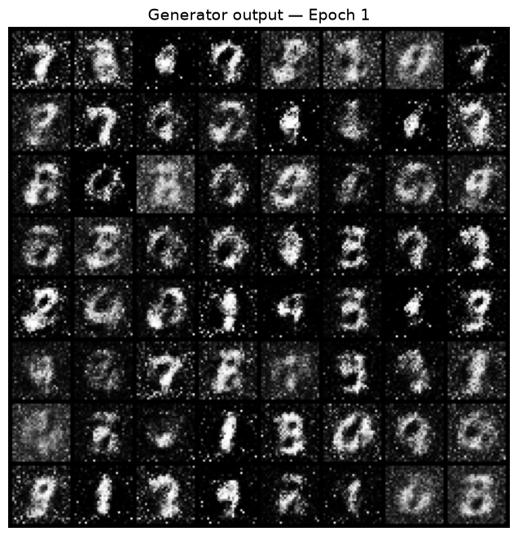
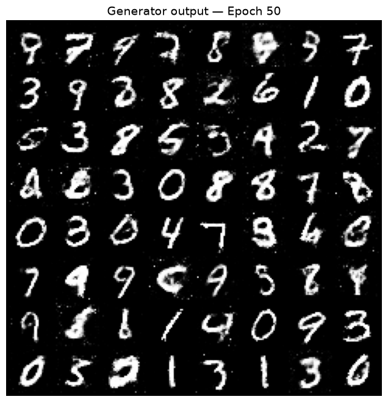
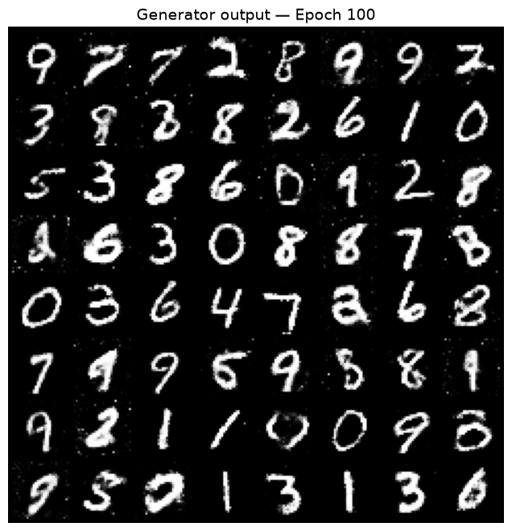
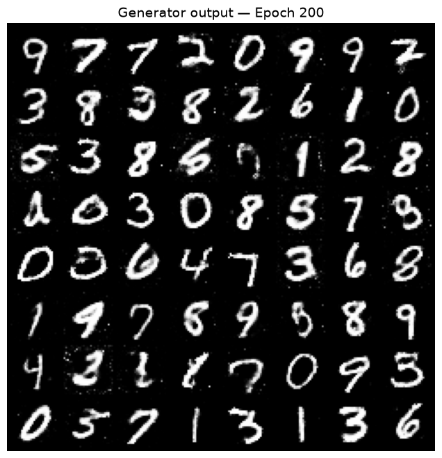
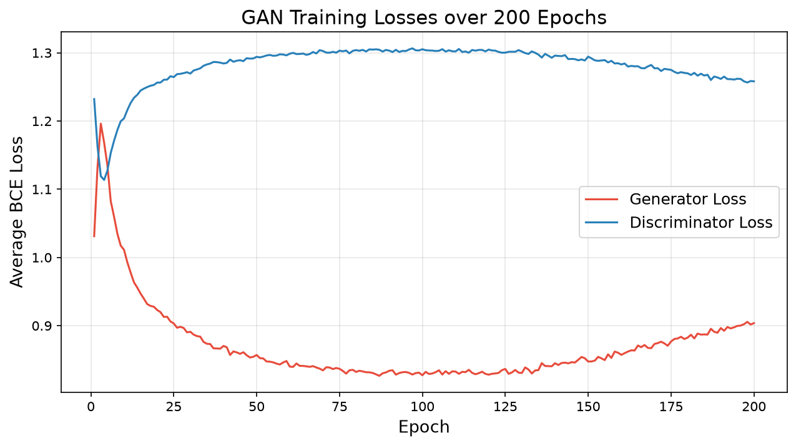

# GAN on MNIST (PyTorch)

A simple Generative Adversarial Network (GAN) built with PyTorch that learns to generate handwritten digit images from random noise, trained on the [MNIST](http://yann.lecun.com/exdb/mnist/) dataset.

- **Generator** – turns a 100-dimensional noise vector into a 28×28 grayscale digit.
- **Discriminator** – classifies an image as real (from MNIST) or fake (from the Generator).

The two networks are trained against each other until the Generator's output becomes hard to tell apart from real digits.

---

## Project Structure

```
GAN_MNIST/
├── GAN_MNIST.py        # Full training script (models + training loop)
├── README.md
├── data/               # MNIST dataset (auto-downloaded on first run)
└── gan_outputs/        # Created automatically during training
    ├── epoch_001.png
    ├── epoch_050.png
    ├── epoch_100.png
    ├── epoch_150.png
    ├── epoch_200.png
    ├── loss_curve.png
    ├── g_losses.npy
    ├── d_losses.npy
    ├── generator_final.pth
    └── discriminator_final.pth
```

---

## Requirements

- Python 3.8+
- PyTorch
- torchvision
- NumPy
- Matplotlib

Install with:

```bash
pip install torch torchvision numpy matplotlib
```

A GPU is optional. The script automatically uses CUDA if available and falls back to CPU otherwise.

---

## Usage

```bash
python GAN_MNIST.py
```

On the first run, MNIST is downloaded automatically into `./data`. Training then runs for 200 epochs, printing losses every 10 epochs.

> **Note:** 200 epochs on CPU can take a long time (469 batches per epoch). If you just want to test the pipeline, lower `NUM_EPOCHS` and `SAVE_EPOCHS` at the top of the script.

---

## Model Architecture

### Generator

Fully-connected MLP: `z (100) → 256 → 512 → 1024 → 784 → reshape to 1×28×28`

- `Linear` + `BatchNorm1d` + `LeakyReLU(0.2)` on each hidden layer
- `Tanh` output, matching the `[-1, 1]` normalisation of the real images

### Discriminator

Fully-connected MLP: `784 → 1024 → 512 → 256 → 1`

- `Linear` + `LeakyReLU(0.2)` + `Dropout(0.3)` on each hidden layer
- `Sigmoid` output giving the probability that the input is real

---

## Hyper-parameters

| Parameter       | Value                 |
|-----------------|-----------------------|
| Seed            | 42                    |
| Batch size      | 128                   |
| Latent dim      | 100                   |
| Learning rate   | 2e-4                  |
| Adam betas      | (0.5, 0.999)          |
| Epochs          | 200                   |
| Loss            | Binary Cross-Entropy  |
| Image snapshots | Epochs 1, 50, 100, 150, 200 |

All values can be changed in the **HYPER-PARAMETERS** section at the top of the script.

---

## How Training Works

For every batch:

1. **Train the Discriminator** – compute BCE loss on real images (label 1) and on generated images (label 0), then update the Discriminator.
2. **Train the Generator** – generate new fakes, pass them through the Discriminator, and compute BCE loss against the *real* label (1). The Generator improves by learning to fool the Discriminator.

A fixed set of 64 noise vectors is reused at each snapshot epoch, so the saved image grids show how the same inputs evolve over training.

---

## Sample Output

Console output from a run:

```
Running on: cpu
Dataset: 60000 images  |  Batches per epoch: 469

Generator:
Generator(
  (net): Sequential(
    (0): Linear(in_features=100, out_features=256, bias=True)
    (1): BatchNorm1d(256, eps=1e-05, momentum=0.1, affine=True, bias=True, track_running_stats=True)
    (2): LeakyReLU(negative_slope=0.2, inplace=True)
    (3): Linear(in_features=256, out_features=512, bias=True)
    (4): BatchNorm1d(512, eps=1e-05, momentum=0.1, affine=True, bias=True, track_running_stats=True)
    (5): LeakyReLU(negative_slope=0.2, inplace=True)
    (6): Linear(in_features=512, out_features=1024, bias=True)
    (7): BatchNorm1d(1024, eps=1e-05, momentum=0.1, affine=True, bias=True, track_running_stats=True)
    (8): LeakyReLU(negative_slope=0.2, inplace=True)
    (9): Linear(in_features=1024, out_features=784, bias=True)
    (10): Tanh()
  )
)

Discriminator:
Discriminator(
  (net): Sequential(
    (0): Linear(in_features=784, out_features=1024, bias=True)
    (1): LeakyReLU(negative_slope=0.2, inplace=True)
    (2): Dropout(p=0.3, inplace=False)
    (3): Linear(in_features=1024, out_features=512, bias=True)
    (4): LeakyReLU(negative_slope=0.2, inplace=True)
    (5): Dropout(p=0.3, inplace=False)
    (6): Linear(in_features=512, out_features=256, bias=True)
    (7): LeakyReLU(negative_slope=0.2, inplace=True)
    (8): Dropout(p=0.3, inplace=False)
    (9): Linear(in_features=256, out_features=1, bias=True)
    (10): Sigmoid()
  )
)
Epoch [  1/200]  D Loss: 1.2322  |  G Loss: 1.0311
  → Saved sample grid: gan_outputs\epoch_001.png
```

### Generated Images

Add your own results here after training, for example:

| Epoch 1 | Epoch 50 | Epoch 100 | Epoch 200 |
|:-------:|:--------:|:---------:|:---------:|
|  |  |  |  |

### Loss Curve



---

## Loading the Trained Generator

```python
import torch
from GAN_MNIST import Generator, LATENT_DIM

G = Generator(LATENT_DIM)
G.load_state_dict(torch.load("gan_outputs/generator_final.pth", map_location="cpu"))
G.eval()

with torch.no_grad():
    z = torch.randn(16, LATENT_DIM)
    images = G(z)   # shape: (16, 1, 28, 28), values in [-1, 1]
```

---

## Notes

- All execution code is under `if __name__ == '__main__':` and `num_workers=0` is used in the `DataLoader`, which avoids multiprocessing errors on Windows.
- Matplotlib uses the non-interactive `Agg` backend, so figures are saved to disk rather than displayed.
- GAN training is not always stable. Watch the loss curves for signs of mode collapse or a Discriminator that overpowers the Generator.

## Possible Improvements

- Replace the MLPs with convolutional layers (DCGAN).
- Use conditional GAN (cGAN) to generate a specific digit on demand.
- Try label smoothing or WGAN-GP for more stable training.

## License

Free to use for learning and experimentation.